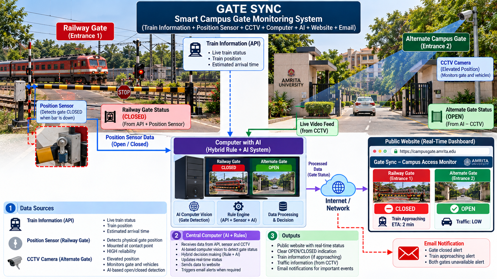

# 🚦 Smart Campus Gate Monitoring System (Gate Sync)

> A Hybrid **AI + Rule-Based** system that monitors a railway-crossing gate and an alternate campus gate in real time and publishes their status to a public dashboard with email alerts.

## ▶ Live Demo (Run the Simulator)

### 👉 **[Click here to open the interactive simulator](https://anvesh06-max.github.io/Smart-Campus-Gate-Monitoring-System/)**

Direct link: https://anvesh06-max.github.io/Smart-Campus-Gate-Monitoring-System/

No installation needed. It runs in any web browser.

**How to use the simulator**
1. Click **Run train-crossing scenario** to watch the full automatic sequence.
2. Or change the inputs yourself using the dropdowns: train state, sensor contact, alternate gate state, camera conditions.
3. Watch the **dashboard** ("Railway Gate: CLOSED", "Alternate Gate: OPEN"), the **rule-engine trace**, and the **email log** update live.

**Run locally (alternative):** download `index.html` and double-click it.

---

## 🖼 Virtual Prototype



---

## 📌 Project Overview

The campus has two entrances:

| Entrance | How its status is determined |
|---|---|
| **Railway Gate** | Train Information API + position sensor at the gate's closed-position contact point |
| **Alternate Gate** | Elevated CCTV camera + AI computer vision (OPEN / CLOSED) |

All data is sent to a **Central Computer with AI**, where the AI vision model classifies the camera feed and the **Hybrid Rule-Based System** fuses every input into a final decision. The result is sent over the Internet to a **public website** and to **email notifications**.

## 🏗 System Architecture (Data Flow)

```
Train Information API ─┐
Position Sensor ───────┼──▶ Central Computer ──▶ Internet / Network ──▶ Website Dashboard
CCTV (Alternate Gate) ─┘    ├─ AI Computer Vision                  └──▶ Email Notifications
                            └─ Hybrid Rule-Based System
```

| Component | Role |
|---|---|
| Train Information API | Provides train schedule / live ETA (JSON) |
| Position Sensor | Detects whether the railway gate is at its closed position |
| CCTV | Elevated camera watching the alternate gate |
| Central Computer with AI | Runs CNN-based OPEN/CLOSED classification with a confidence score |
| Hybrid Rule-Based System | Combines sensor, API and AI outputs into decisions and alerts |
| Internet / Network | Secure HTTPS link to the cloud |
| Website | Public real-time dashboard |
| Email | Alerts for important gate and train events |

## ⚙ Decision Rules

| Rule | Logic |
|---|---|
| R1 | Position sensor contact closed → Railway Gate **CLOSED**, otherwise **OPEN** |
| R2 | Train approaching/at crossing **and** gate OPEN → **CRITICAL** alert |
| R3 | AI confidence below 70% → Alternate Gate **UNCERTAIN**, flagged for review |
| R4 | Both gates CLOSED → "Campus access blocked" alert |
| R5 | Any state change → event logged and email sent |

## ✨ Key Features
- Real-time status: **Railway Gate: OPEN/CLOSED** and **Alternate Gate: OPEN/CLOSED/UNCERTAIN**
- Hybrid design: AI handles perception, rules handle transparent decisions
- Sensor-first logic keeps the railway status dependable if the API or camera fails
- Email alerts for train approach, gate changes and critical events
- Interactive simulation with a rule-engine trace

## 🔧 Bill of Materials (Summary)

| Item | Purpose |
|---|---|
| Edge AI computer (e.g., Jetson Orin Nano / industrial PC) | AI vision + rule engine |
| 4 MP PoE IP camera with IR | Alternate gate monitoring |
| Inductive proximity sensor + backup limit switch | Railway gate position sensing |
| Opto-isolated digital input module | Safe sensor interface |
| PoE switch, cabling, enclosure, surge protection | Networking and protection |
| UPS, dual-WAN/4G router | Power and connectivity backup |
| Cloud VPS, domain, SMTP service | Website and email |


## ✅ Feasibility Summary

| Dimension | Verdict |
|---|---|
| Technical | High: mature components |
| Train API reliability | Medium: must be verified; used as advisory input |
| AI accuracy | Medium-High: needs site-specific tuning (night, fog, glare) |
| Economic | High: low-cost, off-the-shelf parts |
| Safety / Legal | Medium: monitoring tool only; railway-side installation needs approval |

## 👍 Pros and 👎 Cons

| Pros | Cons |
|---|---|
| Real-time visibility for students, staff and visitors | Train API may be delayed or unavailable |
| Transparent, auditable rule-based decisions | AI accuracy drops in poor visibility without tuning |
| Sensor-first logic for dependable railway status | Not a safety-rated system; cannot replace railway signalling |
| Low cost, scalable to more gates | Needs power, network and regular maintenance |
| Email alerts for critical events | Railway-side sensor needs authority permission |

## 🤖 AI Platform Used

The virtual prototype was generated using **Claude (Anthropic)**, model Claude Sonnet 5.5, via the claude.ai chat interface.

<details>
<summary><b>Prompt used to generate the prototype (click to expand)</b></summary>

> Create a detailed engineering virtual prototype of a Smart Campus Gate Monitoring System.
>
> The campus has two entrances: a railway crossing gate and an alternate campus gate. The railway gate status is determined using train information from an API and a position sensor mounted at the gate's closed-position contact point. An elevated CCTV camera is installed near the alternate campus gate to monitor its status.
>
> Show the data from the API, position sensor, and CCTV being transmitted to a central computer with a Hybrid AI + Rule-Based system. The AI-based computer vision should determine whether the gates are OPEN or CLOSED, while the rule-based system processes the combined information.
>
> Also show the central computer connected to a public website/dashboard through the Internet/Network. The dashboard should display the real-time status of both gates with clear labels such as "Railway Gate: CLOSED" and "Alternate Gate: OPEN". Include email notifications for important gate or train events.
>
> Create the prototype as a clean, realistic engineering concept model with clear labels for Train Information API, Position Sensor, CCTV, Railway Gate, Alternate Gate, Central Computer with AI, Hybrid Rule-Based System, Internet/Network, Website, and Email. Use arrows to clearly show the flow of information from the sensors/API/CCTV to the computer and then to the website and email system.

</details>


## 📁 Repository Structure

```
├── README.md               # Project documentation
├── index.html              # Interactive simulator (GitHub Pages)
└── prototype_image.png.png # Screenshot of the virtual prototype
```

## ⚠ Disclaimer

This is an engineering concept and simulation. It is a **monitoring and information tool**, not a safety-rated interlock, and must not replace official railway signalling or gatekeeper procedures. The simulator uses simulated data; it is not connected to a real API, camera or email service.
